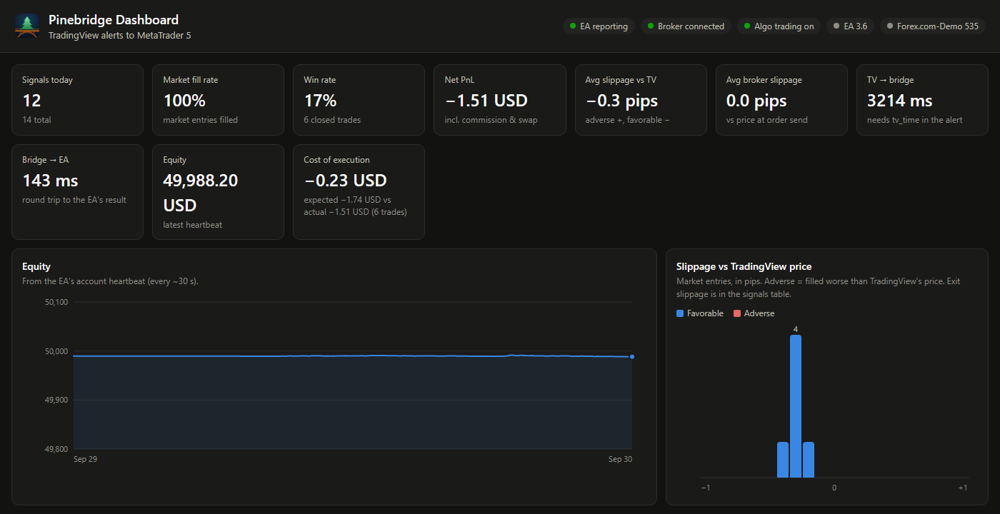
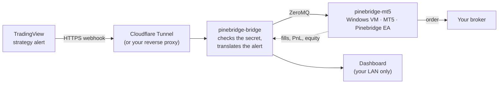
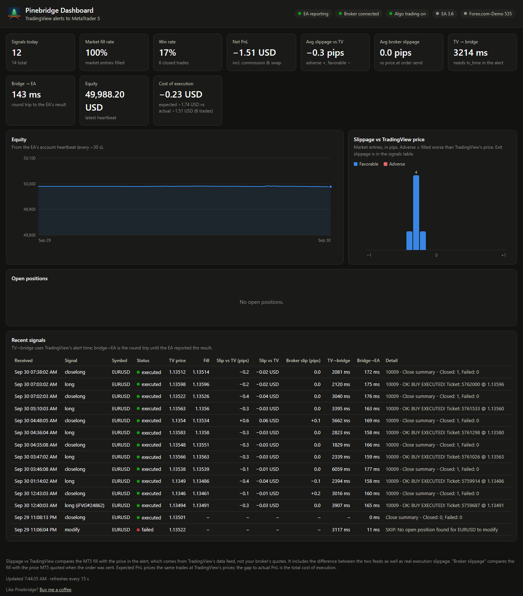
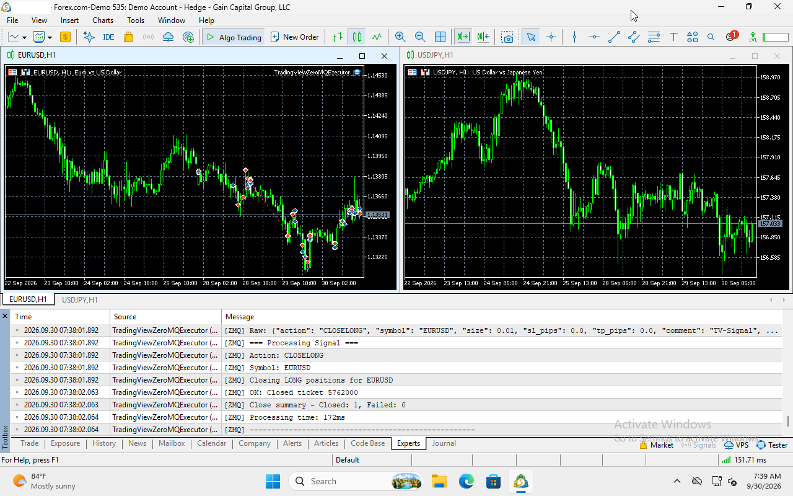
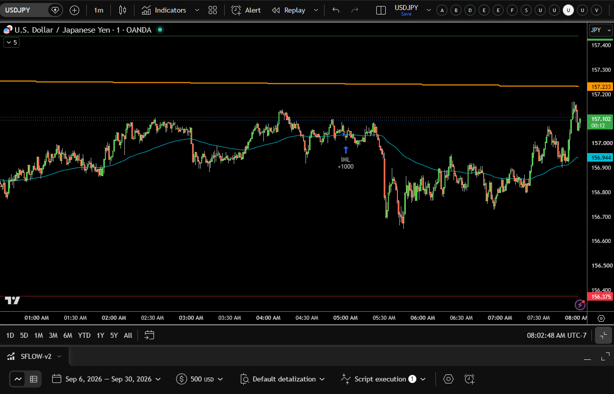

<p align="center"></p>

<h1 align="center">Pinebridge</h1>

<p align="center"><b>Your TradingView strategy alerts, executed in MetaTrader 5 on your own server.</b><br>
Unraid · Docker · Proxmox</p>

<p align="center"><a href="https://buymeacoffee.com/jakeshake"></a></p>

Tired of paying a monthly fee just to get your TradingView alerts into
MetaTrader 5? Or renting a VPS only so MT5 stays online around the clock?
If you have a home server, you already own the hardware for both.
Pinebridge receives your TradingView strategy alerts and places the trades
in MT5, which runs in a Windows VM on your own machine. No signal-relay
subscription, no VPS bill, and your broker login stays on your server
instead of with a third-party service.

<p align="center"></p>

> [!WARNING]
> **Pinebridge places real trades automatically, with no human
> confirmation.** Read the [risk notice](DISCLAIMER.md) and run it on a
> **demo account** first.

## How it works



1. Your Pine strategy fires an alert. Its message says what to do, for
   example `signal=long,symbol=EURUSD,qty=1000,sl_price=...,tp_price=...`.
2. TradingView posts it to your webhook URL. A Cloudflare Tunnel (or your
   own HTTPS reverse proxy) carries it to your server without opening router
   ports.
3. **pinebridge-bridge** rejects anything without your secret, translates
   the alert, and sends it to the Expert Advisor over ZeroMQ in about a
   millisecond.
4. **pinebridge-mt5** is a Windows 11 VM that installs MetaTrader 5 and
   the Pinebridge EA by itself. The EA places the order with your broker:
   market entries and exits, resting limit orders, SL/TP moves and
   double-down adds, with oldest-first closing for US (FIFO) accounts.
5. The EA reports every fill, close and account update back to the bridge,
   and the **Pinebridge Dashboard** shows them.

## Screenshots

**The dashboard** (`http://<server>:8081`, LAN only): every signal and what
happened to it, fill prices, slippage against TradingView's price and the
broker's quote, latency, win rate, PnL, cost of execution and the equity
curve. [More about the dashboard](docs/dashboard.md).

<p align="center"></p>

**MetaTrader 5 in the VM**, running the Pinebridge EA. Its Experts tab
logs each signal as it arrives (here a `CLOSELONG`, closed in 172 ms).
You can watch and control it from a browser on port 8006.

<p align="center"></p>

**A TradingView strategy** sending its orders as Pinebridge alerts.

<p align="center"></p>

## What you need

| | |
|---|---|
| **TradingView** | A paid plan that includes webhook alerts, with two-factor authentication turned on (TradingView requires it for webhooks). |
| **A Pine strategy** | One that builds its alert messages in the [Pinebridge alert format](docs/tradingview-alert-format.md). An indicator or someone else's script that sends other text won't work as-is. |
| **An MT5 broker account** | Any broker that offers MetaTrader 5. **Use a demo account first.** Your TradingView symbol has to match the MT5 symbol exactly (`EURUSD`, not `EURUSD.a`). |
| **A public HTTPS address** | TradingView only sends webhooks to `https://`. A free Cloudflare account with a domain on it (for the tunnel), or a reverse proxy you already run. |
| **A Windows licence** | The VM installs Windows 11 from Microsoft's evaluation image. You're responsible for licensing it properly. |
| **A server that stays on** | Trades only happen while the server, the VM and MT5 are running. |

### Hardware

The Windows VM is what needs resources. The bridge itself uses about 50 MB
of RAM.

| | Minimum | Recommended (tested) |
|---|---|---|
| **CPU** | x86-64 with virtualization (Intel VT-x or AMD-V) enabled in BIOS, so `/dev/kvm` exists | 4+ cores; the VM gets 2 |
| **RAM** | 6 GB free (4 GB for the VM, Windows 11's minimum) | 10 GB free (8 GB for the VM) |
| **Disk** | 30 GB free | 64 GB free. The VM's disk grows as it's used: about 17 GB after install, plus a ~6 GB Windows download during setup |
| **Network** | Always-on internet | Wired |

Measured on the test server (Intel i7-12700K, VM with 8 GB and 2 cores):
the running VM uses about 5% CPU. ARM machines (Raspberry Pi, Apple
Silicon) can't run the Windows VM, but can run the bridge with
[your own MT5](docs/docker-install.md#bring-your-own-mt5-windows-pc-vm-or-vps).

## Install

| Platform | Guide |
|---|---|
| **Unraid** | Open **Apps**, search **Pinebridge**, install `pinebridge-mt5` and `pinebridge-bridge`. Details: [docs/unraid-install.md](docs/unraid-install.md) |
| **Linux + Docker** | [`docker-compose.yml`](docker-compose.yml) with the published images: [docs/docker-install.md](docs/docker-install.md) |
| **Proxmox VE** | Docker in a VM with nested virtualization, or in an LXC: [docs/docker-install.md#proxmox-ve](docs/docker-install.md#proxmox-ve) |
| **Windows PC, Docker Desktop, ARM, or your existing MT5** | Bridge in Docker, EA on your Windows machine: [Bring your own MT5](docs/docker-install.md#bring-your-own-mt5-windows-pc-vm-or-vps) |

Quick look at the Docker route:

```bash
mkdir pinebridge && cd pinebridge
curl -fsSLO https://raw.githubusercontent.com/jakeshake/pinebridge/main/docker-compose.yml
curl -fsSL -o .env https://raw.githubusercontent.com/jakeshake/pinebridge/main/.env.example
nano .env                  # your MT5 demo login and a Windows password
docker compose up -d       # add --profile tunnel for the Cloudflare Tunnel
```

## What's automated and what you do yourself

**Pinebridge does:**
- the Windows install, MetaTrader 5, the ZeroMQ library, compiling the EA,
  attaching it to a chart, and the firewall rule, all on the first boot
- a webhook secret, generated on first start. The bridge log prints your
  exact webhook URL and alert Message.
- close retries after broker disconnects, FIFO-compliant closing, and a
  readable reason for every broker error in the dashboard

**You do:**
1. **Enter your broker login** in the template or `.env` before the first
   boot.
2. **Create the tunnel or HTTPS hostname.** It happens in your Cloudflare
   account ([guide](docs/cloudflare-tunnel-setup.md)) or your reverse
   proxy. Point it at the webhook port only.
3. **Watch the first boot** at `http://<server>:8006`. It takes about 15-70
   minutes. Leave the VM alone until MT5 shows the EA on a chart.
4. **Create the TradingView alert** on your strategy, with the webhook URL
   (including your secret) and the Message from the bridge log. Condition:
   **Order fills and alert() function calls**.
5. **Test on a demo account**, and check the dashboard shows each signal as
   executed before you think about a live account.

## Things to know

- **Alert delay.** TradingView usually takes 1-6 seconds to deliver a
  webhook. The dashboard shows it as "TV → bridge". Pinebridge suits
  strategies on minute-and-up timeframes, not scalping on ticks.
- **Start alerts while the strategy is flat.** If you create an alert while
  TradingView's strategy is already in a trade, MT5 never saw that entry,
  and the exits and SL/TP moves that follow are skipped ("no open
  position"). They sort themselves out at the next fresh entry.
- **Your broker login is read once, at the first boot.** To change accounts
  later, log in again inside MT5. After switching accounts or re-attaching
  the EA, re-tick **Allow Algo Trading** and **Allow DLL imports**
  (otherwise you get `10027 - auto trading disabled by client`).
- **US (FIFO) accounts** don't allow opposite positions. Have your strategy
  close a position before reversing it.
- **EA updates** in a new image don't reach an already-installed VM on
  their own. Copy the new EA in, recompile it, and re-attach it on the
  chart: see [mt5-ea-setup.md](docs/mt5-ea-setup.md).
- **Slippage vs TradingView** compares the MT5 fill with TradingView's
  price, which comes from TradingView's data feed, so it includes the
  difference between the two feeds as well as real slippage.
- **Keep the dashboard private.** It shows your balance and positions.
  Never add port 8081 to your tunnel, and set `DASHBOARD_PASSWORD` if
  others use your network.

## Security

- The webhook needs your secret (`?secret=...` in the URL; TradingView
  can't send custom headers). Anything without it gets `401`.
- Public traffic goes through a Cloudflare Tunnel or your reverse proxy,
  never a forwarded port, and only ever reaches the webhook.
- Broker and Windows credentials are never baked into the images. You
  supply them at runtime.

## Documentation

- [Unraid install](docs/unraid-install.md) · [Docker, Proxmox and bring-your-own-MT5](docs/docker-install.md)
- [Cloudflare Tunnel setup](docs/cloudflare-tunnel-setup.md)
- [TradingView alert format](docs/tradingview-alert-format.md) (what your Pine strategy should send)
- [MT5 and EA setup, troubleshooting](docs/mt5-ea-setup.md) · [Dashboard](docs/dashboard.md) · [Architecture](docs/architecture.md)

## Support

- Questions and help: the [Unraid forum support thread](https://forums.unraid.net/topic/200736-support-jakeshake-pinebridge-tradingview-alerts-%E2%86%92-metatrader-5/)
- Bugs and feature requests: [GitHub issues](https://github.com/jakeshake/pinebridge/issues)

When asking for help, include the bridge log (`docker logs pinebridge-bridge`,
with your secret removed), MT5's **Experts** tab, and your broker and
account type (demo or live, hedging or netting).

## Status

Running on Unraid with a Forex.com demo account: automatic first-boot
install; live TradingView alerts end to end (market entries and exits,
resting limit orders, double-down adds, SL/TP moves); close retries after a
broker disconnect; FIFO-compliant closing on a US account; and the
dashboard's fills, slippage and latency from real alerts. Docker Compose
uses the same images. Proxmox and bring-your-own-MT5 reports are welcome.

## Repo layout

- `signal-bridge/`: the `pinebridge-bridge` image (Flask webhook, ZeroMQ, dashboard)
- `mt5-windows/`: the `pinebridge-mt5` image, built on dockur/windows; `oem/` holds the provisioning scripts and the EA source
- `unraid-templates/`: the Unraid templates listed in Community Applications
- `extras/`: the optional `pinebridge-tunnel` Unraid template (`.template`, not `.xml`, so Community Applications doesn't list a second cloudflared)
- `docs/`: setup guides

## Support the project

If Pinebridge saves you a VPS or a signal subscription, consider
[buying me a coffee](https://buymeacoffee.com/jakeshake).

## License

[MIT](LICENSE). Please also read the [automated trading risk notice](DISCLAIMER.md).
